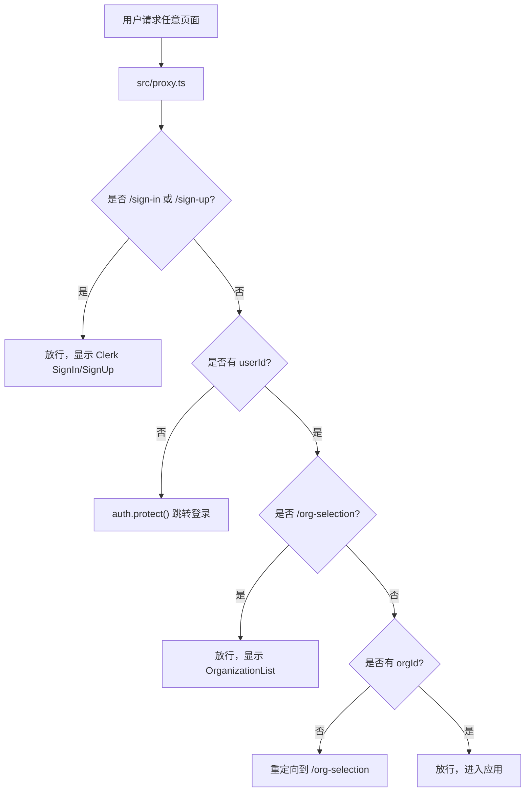

# Project Setup Auth DB 开发日志

这份日志根据课程 script、当前 codebase 和 git history 整理。它不是逐字稿，而是把这节课真正要学会的东西拆成可以复用的方法论：以后再搭一个 SaaS / AI app / multi-tenant app 时，你知道每段代码为什么存在，以及什么时候应该照搬、调整或警惕。

## 这节课的核心目标

这节课不是在做一个完整功能，而是在搭应用的地基：

1. Next.js App Router 项目结构
2. shadcn/ui + Tailwind v4 设计系统基础
3. Clerk 登录、注册、组织选择和 multi-tenancy
4. Prisma + Postgres 数据模型、迁移和类型安全查询
5. 环境变量校验
6. 开发环境下安全复用 Prisma Client
7. 为部署准备构建和生成流程

用一句话概括：这节课是在建立“应用入口、用户边界、租户边界、数据库边界”。

## Git History 对照

当前仓库的关键提交：

- `cd3c8b4 Initial commit from Create Next App`
  - 只有 Next.js 初始模板。
  - 还没有 Clerk、shadcn、Prisma。

- `c9e8908 01projectsetup auth&database`
  - 对应这节课的大部分内容。
  - 新增/修改了 UI 基础、认证页面、proxy 保护逻辑、Prisma schema、migration、env/db helper。

- `3264333 Remove CLAUDE.md and AGENTS.md from version control`
  - 清理仓库元信息，把 agent 指令文件从版本控制中移除。

这说明你的项目目前已经完成了课程第一章的大部分地基工作。

## 当前代码结构和课程步骤的映射

| 课程概念 | 当前文件 | 作用 |
| --- | --- | --- |
| Next.js 根布局 | `src/app/layout.tsx` | 全局包裹 HTML、body、字体、ClerkProvider、Toaster |
| 首页 | `src/app/page.tsx` | 登录后展示组织切换器和用户菜单 |
| 登录页 | `src/app/sign-in/[[...sign-in]]/page.tsx` | Clerk 自定义登录页面 |
| 注册页 | `src/app/sign-up/[[...sign-up]]/page.tsx` | Clerk 自定义注册页面 |
| 组织选择页 | `src/app/org-selection/page.tsx` | 强制用户选择或创建组织 |
| 路由保护 | `src/proxy.ts` | 请求进入页面前判断是否登录、是否有组织 |
| 数据库模型 | `prisma/schema.prisma` | 定义 Voice、Generation、枚举和关系 |
| 数据库迁移 | `prisma/migrations/20260705051701_init/migration.sql` | schema 对应的 SQL 变更记录 |
| Prisma 配置 | `prisma.config.ts` | 告诉 Prisma schema、migration、DATABASE_URL 在哪 |
| 环境变量校验 | `src/lib/env.ts` | 用 zod/T3 env 保证 DATABASE_URL 存在 |
| Prisma Client 单例 | `src/lib/db.ts` | 统一创建并导出 prisma 实例 |
| DB 测试页 | `src/app/test/page.tsx` | 在 Server Component 里查询 voices |

## 第一层：Next.js App Router 的心智模型

Next.js App Router 的核心规则：

- `src/app/layout.tsx` 是全局外壳。
- `src/app/page.tsx` 是 `/` 页面。
- `src/app/foo/page.tsx` 是 `/foo` 页面。
- `src/app/sign-in/[[...sign-in]]/page.tsx` 是 `/sign-in` 以及 `/sign-in/...` 的 catch-all 页面。

课程里先确认 `src/` 和 `app/` 存在，是因为后面所有路由、layout、proxy 都依赖这个结构。

你的 `layout.tsx` 现在做了三件重要的事：

```tsx
<ClerkProvider>
  <html lang="en">
    <body>
      {children}
      <Toaster />
    </body>
  </html>
</ClerkProvider>
```

为什么这样写：

- `children` 是当前路由页面。
- `ClerkProvider` 放在最外层，是为了让所有页面和 Clerk 组件都能读到登录状态。
- `Toaster` 放在 root layout，是为了任何页面都可以触发 toast，不需要每页重复挂载。

可复用原则：

- 全局 provider 放 layout。
- 单个页面用到的 UI 放 page/component。
- 需要包住整个 app 的能力，例如 auth、theme、toast、query client，优先放 root layout。

## 第二层：shadcn/ui 的方法论

shadcn/ui 不是传统意义上的 npm 组件库。它更像“把组件源码复制进你的项目”。

这件事的好处：

- 组件在 `src/components/ui/`，你能直接改。
- Tailwind class、variant、size 都在本地代码里。
- AI agent 和你自己都能直接读懂、修改、扩展。

课程里先加 button，再 `add --all`，是为了建立完整 UI 工具箱。当前仓库也已经有完整的 `src/components/ui/` 组件集。

最重要的基础工具是：

```ts
// src/lib/utils.ts
cn()
```

它一般组合了 `clsx` 和 `tailwind-merge`：

- `clsx` 负责条件 class。
- `tailwind-merge` 负责解决 Tailwind class 冲突。

可复用原则：

- 业务组件不要到处手写复杂 class 拼接，统一用 `cn()`。
- shadcn 组件可以改，但要知道它们是基础设施，不要在里面塞业务逻辑。
- 课程里加所有组件是为了教程方便；真实项目里可以按需添加，减少维护面。

## 第三层：Clerk Auth + Multi-tenancy

这节课最关键的业务边界是：

> 用户必须登录，并且必须选择组织，才能使用应用。

这不是单纯的“登录保护”，而是 multi-tenant SaaS 的基础。

### 认证流程图



### `src/proxy.ts` 为什么这样写

当前代码：

```ts
const isPublicRoute = createRouteMatcher(["/sign-in(.*)", "/sign-up(.*)"]);
const isOrgSelectionRoute = createRouteMatcher(["/org-selection(.*)"]);
```

这里用 matcher 是为了把“路由规则”抽出来，不要在业务判断里到处写字符串比较。

`"/sign-in(.*)"` 的意思是：

- `/sign-in`
- `/sign-in/anything`
- Clerk 多步骤登录中可能产生的嵌套路由

都算作登录页。

核心逻辑：

```ts
const { userId, orgId } = await auth();
```

`userId` 表示“这个请求是不是来自已登录用户”。

`orgId` 表示“这个请求当前有没有选中的组织上下文”。

后续判断顺序很重要：

1. 先允许 public route
2. 再保护非 public route
3. 再允许组织选择页
4. 最后要求普通受保护页面必须有 orgId

为什么不能先检查 orgId：

- 未登录用户本来就没有 orgId。
- 登录页和注册页不应该被组织逻辑拦住。
- 组织选择页本身就是为了补齐 orgId，如果拦住它会造成死循环。

### `auth.protect()` 是什么

`auth.protect()` 是 Clerk server-side helper。它的意义是：

- 如果当前请求没有登录身份，Clerk 接管跳转到登录流程。
- 如果已经登录，则继续。

这里不是在客户端按钮点击后检查，而是在请求进入页面前检查。这比在页面里写 `if (!user) redirect()` 更底层，覆盖面更广。

可复用原则：

- “整站都要保护，只有少数页面公开”时，用默认保护 + public allowlist。
- “只有少数页面要保护”时，反过来写 protected matcher。
- multi-tenant app 一定要把 `orgId` 当成数据访问边界，而不只是 UI 状态。

## 第四层：为什么登录/注册页是 `[[...sign-in]]`

文件：

```text
src/app/sign-in/[[...sign-in]]/page.tsx
src/app/sign-up/[[...sign-up]]/page.tsx
```

这叫 optional catch-all route。

拆开看：

- `[param]`：动态路由，必须有一段。
- `[...param]`：catch-all，可以接多段。
- `[[...param]]`：optional catch-all，可以没有，也可以有多段。

为什么 Clerk 需要这个：

登录/注册不是单页面动作，可能有：

- 邮箱验证码
- OAuth 回调
- 多因素认证
- reset password
- magic link
- session transfer

这些流程可能需要 `/sign-in/something/...`。所以 Clerk 官方建议把 SignIn/SignUp 放在 optional catch-all route 下。

可复用原则：

- 第三方 auth 组件如果有多步骤 flow，按官方路由结构写，不要简化成普通 `/sign-in/page.tsx`。
- 组织选择不是 Clerk 官方 sign-in flow 的一部分，所以它是普通 `/org-selection/page.tsx`。

## 第五层：为什么强制组织，而不是允许 personal account

`src/app/org-selection/page.tsx`：

```tsx
<OrganizationList
  hidePersonal
  afterCreateOrganizationUrl="/"
  afterSelectOrganizationUrl="/"
/>
```

`hidePersonal` 的意义是：不允许用户以“个人空间”使用 app，而是必须处于某个组织。

这会让后续数据模型简单很多：

- 所有业务数据都可以挂在 `orgId` 下。
- 团队邀请、角色、权限天然有地方放。
- 即使一个人使用，也可以创建一个 solo organization。

如果不这么做，后面每张表都要考虑：

- 这条数据属于 user 还是 org？
- 个人数据和团队数据怎么迁移？
- 邀请别人后，原来的个人数据怎么归属？

可复用原则：

- 如果产品未来有团队协作，第一天就按 organization 建模。
- 不要等到后面再从 user-owned data 迁移到 org-owned data，成本很高。

## 第六层：首页为什么放 `OrganizationSwitcher` 和 `UserButton`

`src/app/page.tsx`：

```tsx
<OrganizationSwitcher />
<UserButton />
```

这两个不是装饰组件，而是非常强的开发加速器：

- `UserButton` 给用户账户设置、退出登录、管理 profile。
- `OrganizationSwitcher` 给用户切换组织、进入组织管理、接受邀请。

它们让你不用自己实现一整套账户系统。

可复用原则：

- 在 app shell 或 dashboard 顶栏里放 `UserButton`。
- multi-tenant app 一定要提供组织切换入口，否则用户很难理解当前数据属于哪个租户。

## 第七层：Prisma schema 的设计意图

当前 schema 有两个主模型：

- `Voice`
- `Generation`

还有两个 enum：

- `VoiceVariant`
- `VoiceCategory`

### Voice

```prisma
model Voice {
  id          String        @id @default(cuid())
  orgId       String?
  name        String
  description String?
  category    VoiceCategory @default(GENERAL)
  language    String        @default("en-US")
  variant     VoiceVariant
  r2ObjectKey String?
  generations Generation[]
  createdAt   DateTime      @default(now())
  updatedAt   DateTime      @updatedAt

  @@index([variant])
  @@index([orgId])
}
```

关键点：

- `orgId` 是 optional。
- 如果 `orgId` 为空，表示 system voice。
- 如果 `orgId` 有值，表示某个组织创建的 custom voice。

这是一种很常见的 SaaS 设计：

- 平台内置资源：不属于任何租户。
- 用户自定义资源：属于某个租户。

为什么不用一个 boolean `isSystem`：

- 当前代码已经有 `variant: SYSTEM | CUSTOM` 表达类型。
- `orgId` 表达 ownership。
- 两者组合更清晰。

建议的业务约束：

- `SYSTEM` voice 应该没有 `orgId`。
- `CUSTOM` voice 应该有 `orgId`。

当前 Prisma schema 还没有强制这个交叉约束。后面业务代码创建 voice 时需要自己保证。

### Generation

```prisma
model Generation {
  id          String   @id @default(cuid())
  orgId       String
  voiceId     String?
  voice       Voice?   @relation(fields: [voiceId], references: [id], onDelete: SetNull)
  voiceName   String
  text        String
  r2ObjectKey String?
  temperature Float
  topP        Float
  topK        Int
  repetitionPenalty Float
  createdAt   DateTime @default(now())
  updatedAt   DateTime @updatedAt

  @@index([orgId])
  @@index([voiceId])
}
```

关键点：

- `orgId` 必填，因为生成记录一定属于某个组织。
- `voiceId` 可空。
- `onDelete: SetNull` 表示 voice 被删后，不删除 generation。
- `voiceName` 是冗余快照，用来保留历史显示。

为什么 `onDelete` 不用 `Cascade`：

- 如果删除一个 voice 就连带删除所有 generation，用户历史记录会丢失。
- TTS 历史通常是用户资产，不应该因为 voice 被删除而消失。

为什么要保存 `voiceName`：

- 关系可断开，但历史记录仍需要显示“当时用的是哪个声音”。
- 这是 audit/history 场景常见做法：保存一份关键字段快照。

为什么 `r2ObjectKey` 可空：

- 一条 generation 可能先创建数据库记录，再异步生成音频并上传 R2。
- 上传完成前，它还没有音频文件 key。
- 可空字段表达“处理中/未完成”状态。

可复用原则：

- 历史记录不要过度依赖可删除的外键。
- 异步任务经常需要“先建记录，后补结果”。
- `onDelete` 是产品决策，不只是数据库语法。

## 第八层：migration 为什么要提交，generated client 为什么不提交

当前 `.gitignore` 里有：

```gitignore
/src/generated/prisma
```

但 migration 文件被提交：

```text
prisma/migrations/20260705051701_init/migration.sql
```

原因：

- migration 是数据库历史，必须版本控制。
- generated client 是从 schema 生成的产物，可以重建，不应该手动维护。

心智模型：

```text
schema.prisma     = 数据模型源代码
migrations/*.sql  = 数据库变更历史
generated/prisma  = 根据 schema 生成的类型和 client
```

可复用原则：

- schema 和 migrations 提交。
- generated client 不提交。
- 部署环境必须能运行 `prisma generate`，否则构建时找不到 `@/generated/prisma/client`。

## 第九层：`src/lib/db.ts` 为什么要写 singleton

当前代码：

```ts
const adapter = new PrismaPg({
  connectionString: env.DATABASE_URL,
});

const globalForPrisma = global as unknown as { prisma: PrismaClient };

const prisma = globalForPrisma.prisma || new PrismaClient({ adapter });

if (process.env.NODE_ENV !== "production") globalForPrisma.prisma = prisma;

export { prisma };
```

最容易困惑的是 global singleton。

如果你只写：

```ts
export const prisma = new PrismaClient({ adapter });
```

在普通 Node 服务里可能没问题，但在 Next.js dev server 里有风险。

原因是 Next.js 开发环境有 hot reload。你每保存一次文件，模块可能重新加载。如果每次 reload 都 new 一个 PrismaClient，就可能不断创建数据库连接，最后连接池耗尽。

所以做法是：

- 开发环境：把 PrismaClient 缓存在 `global` 上，热更新后继续复用。
- 生产环境：直接创建实例，避免长期污染 global。

可复用原则：

- Next.js + Prisma 项目里，几乎都应该用 singleton pattern。
- 数据库 client 不要在每个页面/函数里 new。
- 建一个 `src/lib/db.ts` 作为唯一入口，所有查询都从这里 import。

## 第十层：为什么要用 `src/lib/env.ts`

当前代码：

```ts
export const env = createEnv({
  server: {
    DATABASE_URL: z.string().min(1),
  },
  experimental__runtimeEnv: {},
  skipValidation: !!process.env.SKIP_ENV_VALIDATION,
});
```

不用它时，你会写：

```ts
process.env.DATABASE_URL
```

问题是：

- 拼错 `DATABASE_URL`，TypeScript 不会提醒。
- 环境变量缺失时，可能到运行数据库查询才爆炸。
- 部署环境和本地环境不一致时，错误很晚才暴露。

使用 `@t3-oss/env-nextjs` + `zod` 后：

- 代码里只能访问声明过的 env。
- 缺少 env 时启动就失败。
- 错误更早、更明确。

`skipValidation` 的意义：

- 某些生产构建阶段无法读取完整 runtime env。
- 设置 `SKIP_ENV_VALIDATION=true` 可以跳过构建时校验。
- 但这也意味着你要确保运行时平台真的配置了变量。

可复用原则：

- 所有 env 都集中在 `src/lib/env.ts` 声明。
- server-only secret 放 `server`。
- client 可见变量必须以 `NEXT_PUBLIC_` 开头，并单独声明。
- 不要在业务代码里散落 `process.env.X`。

## 第十一层：Server Component 查询数据库

`src/app/test/page.tsx`：

```tsx
export default async function TestPage() {
  const voices = await prisma.voice.findMany();

  return (
    <div>
      {voices.map((voice) => (
        <li key={voice.id}>{voice.name} - {voice.variant}</li>
      ))}
    </div>
  );
}
```

为什么 page 可以是 async：

- App Router 里的 Server Component 可以直接 `await`。
- 默认情况下，`page.tsx` 是 Server Component，除非你写 `"use client"`。
- Server Component 运行在服务端，可以安全访问数据库。

为什么这不像泄漏数据库：

- `prisma.voice.findMany()` 在服务端执行。
- 发送给浏览器的是渲染结果，不是 Prisma Client 或 DATABASE_URL。

什么时候不能这样写：

- 如果文件顶部有 `"use client"`，就不能直接访问数据库。
- 如果需要用户交互状态、浏览器 API、onClick，就要拆成 Client Component。

可复用原则：

- 读数据库优先放 Server Component、Server Action 或 Route Handler。
- Client Component 只处理交互，不直接持有数据库访问能力。

## 第十二层：当前代码和课程内容的差异/风险

### 1. 缺少 `postinstall`

课程后半段提到部署时需要：

```json
"postinstall": "prisma generate"
```

你的当前 `package.json` 没有这个脚本。

风险：

- `src/generated/prisma` 被 gitignore。
- 部署环境 clone 代码后没有 generated client。
- 构建时 import `@/generated/prisma/client` 可能失败。

建议后续加上：

```json
"scripts": {
  "dev": "next dev",
  "build": "next build",
  "start": "next start",
  "lint": "eslint",
  "postinstall": "prisma generate"
}
```

### 2. 课程使用的版本和当前项目版本不完全一致

课程提到 Next.js `16.1.6`、shadcn `3.8.5` 一类固定版本。

当前项目：

- `next`: `16.2.6`
- `shadcn`: `^4.11.0`
- `@prisma/client`: `^7.8.0`
- `@clerk/nextjs`: `^7.5.12`

这不是错误，但学习时要注意：

- 教程固定版本是为了减少不确定性。
- 你当前版本更新，API 可能有细节差异。
- 遇到错误时，先看 major version 是否一致。

### 3. `AGENTS.md` 里曾写“没有 middleware”，但实际已有 `src/proxy.ts`

当前代码已经有 `src/proxy.ts`，所以旧说明和实际仓库不一致。

在 Next.js 16 语境里，课程说以前叫 `middleware.ts`，现在叫 `proxy.ts`。你的项目跟课程保持一致。

## 这节课真正要内化的方法论

### 1. 先建立边界，再写功能

这节课没有马上做 ElevenLabs clone 的核心 UI，而是先建立：

- 用户边界：谁能进来？
- 租户边界：数据属于哪个组织？
- 数据边界：表结构如何表达业务？
- 环境边界：缺少 secret 时如何快速失败？
- 查询边界：数据库 client 从哪里来？

这是成熟项目的顺序。

### 2. 用框架约定减少自定义代码

这节课大量依赖框架约定：

- Next.js App Router 文件即路由
- Clerk 组件即 auth UI
- Clerk proxy 即请求保护
- Prisma schema 即数据库和类型源头
- shadcn 组件即本地设计系统基础

好的应用不是每层都自己造，而是知道哪些问题交给框架，哪些地方保留业务决策。

### 3. Multi-tenancy 要从第一天进入数据模型

`orgId` 不是附属字段，它是未来所有核心查询的过滤条件。

以后你写查询时应该自然想到：

```ts
where: {
  orgId: currentOrgId,
}
```

而不是：

```ts
findMany()
```

测试页可以 `findMany()`，真实业务页不应该这么随意。

### 4. 数据模型要为未来异步流程留空间

`Generation.r2ObjectKey` 可空不是随便可空，而是为了支持：

1. 用户提交文本
2. 创建 generation 记录
3. 后台生成音频
4. 上传到 R2
5. 回写 object key

这就是异步任务建模。

### 5. 删除策略是产品逻辑

`onDelete: SetNull` 表达的是：

- 删除 voice 不应该删除用户历史 generation。
- 历史记录需要保留当时的 voiceName。

以后设计 relation 时，不要机械使用 cascade。先问：

- 父记录删除后，子记录还有没有业务价值？
- 是否需要保留历史？
- 是否需要审计？

## 以后复用这套地基的 Checklist

新建一个类似项目时，可以按这个顺序检查：

1. Next.js
   - 是否使用 `src/`
   - 是否使用 App Router
   - 根布局是否挂好全局 provider

2. UI
   - 是否初始化 shadcn
   - 是否有 `cn()`
   - 基础组件是否只负责 UI，不塞业务逻辑

3. Auth
   - 是否有 `ClerkProvider`
   - 是否有 `src/proxy.ts`
   - public routes 是否明确
   - protected routes 是否默认保护

4. Multi-tenancy
   - 是否强制 organization
   - 页面是否提供 organization switcher
   - 业务表是否有 `orgId`
   - 查询是否按 `orgId` 过滤

5. Database
   - schema 是否表达真实业务状态
   - migration 是否提交
   - generated client 是否 gitignore
   - 是否有 `postinstall: prisma generate`

6. Env
   - 是否集中到 `src/lib/env.ts`
   - 是否用 zod 校验
   - secret 是否没有提交

7. Prisma Client
   - 是否只在 `src/lib/db.ts` 创建
   - 是否使用 global singleton
   - 页面/服务是否统一 import `prisma`

8. Deploy
   - 生产环境是否配置 Clerk keys
   - 生产环境是否配置 DATABASE_URL
   - 是否配置 `SKIP_ENV_VALIDATION`
   - build 前是否能 generate Prisma Client

## 你现在可以重点回头理解的代码

建议按这个顺序读：

1. `src/app/layout.tsx`
   - 理解 provider 和 children。

2. `src/proxy.ts`
   - 理解请求进入页面前如何被 auth gate 拦截。

3. `src/app/sign-in/[[...sign-in]]/page.tsx`
   - 理解 optional catch-all route。

4. `src/app/org-selection/page.tsx`
   - 理解 `hidePersonal` 和 multi-tenancy。

5. `prisma/schema.prisma`
   - 理解业务模型如何提前为系统声音、自定义声音、历史生成记录、异步音频上传做准备。

6. `src/lib/env.ts`
   - 理解为什么不直接写 `process.env.DATABASE_URL`。

7. `src/lib/db.ts`
   - 理解为什么 Next.js dev 需要 Prisma singleton。

8. `src/app/test/page.tsx`
   - 理解 Server Component 直接查数据库。

## 一个更短的记忆版

这节课的地基可以记成：

```text
Next layout 提供全局上下文
proxy 保护请求入口
Clerk 提供用户和组织身份
orgId 划分租户数据
Prisma schema 是数据库和类型的源头
migration 记录数据库历史
env.ts 提前发现配置错误
db.ts 统一且安全地复用 Prisma Client
Server Component 可以安全查询数据库
```

如果以后你能按这个顺序解释一个新项目的地基，说明这节课你就不是只学了表面操作，而是真的掌握了可迁移的方法论。
